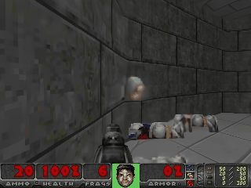
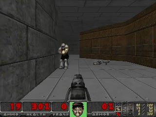

## Getting Started

Note: It might not provide the same results as GameNGen, just doing it for fun. This model/inference has not been tuned sufficiently to achieve 20 FPS as described in the paper.

## Fork this repository to collaborate




## Scripts To Run

### Generate the training data

First, cd into ViZDoomPPO/ and generate the venv from the `requirements.txt` file.

Following command to train an agent on vizdoom:
```
python train_ppo_parallel.py
```

Once the agent is trained, generate episodes and upload them as a HF dataset using:
```
python load_model_generate_dataset.py --episodes {number of episodes} --output parquet --upload --hf_repo {name of the repo}
```

Note: you can also generate a gif file to QA the behavior of the agent by running:
```
python load_model_generate_dataset.py --episodes 1 --output gif
```

### Train LLM based diffusion model (not yet implemented)

Debug on a single sample:
```
python train_text_to_image.py  \
    --dataset_name arnaudstiegler/vizdoom-episode  \
    --gradient_checkpointing  \
    --train_batch_size 12  \
    --learning_rate 5e-5  \
    --num_train_epochs 1500  \
    --validation_steps 250  \
    --dataloader_num_workers 18 \
    --max_train_samples 2 \
    --use_cfg \
    --report_to wandb
```

Full training
```
python train_text_to_image.py \
    --dataset_name arnaudstiegler/vizdoom-500-episodes-skipframe-4-lvl5 \
    --gradient_checkpointing \
    --learning_rate 5e-5 \
    --train_batch_size 12 \
    --dataloader_num_workers 18 \
    --num_train_epochs 3 \
    --validation_steps 1000 \
    --use_cfg \
    --output_dir sd-model-finetuned \
    --push_to_hub \
    --lr_scheduler cosine \
    --report_to wandb
```

### Train the auto-encoder

```
python finetune_autoencoder.py --hf_model_folder {path to the model folder}
```

### Run inference (generating a single image)

```
python run_inference.py --model_folder arnaudstiegler/sd-model-gameNgen-60ksteps
```

### Run autoregressive inference

This will generate rollouts, where each new frame is generated by the model based on the previous frames and actions.
Initially fill the buffer using the small dataset and sample actions from the dataset (i.e it matches what the agent did in the episode) just simple as that

```
python run_autoregressive.py --model_folder arnaudstiegler/sd-model-gameNgen-60ksteps
```

## To-Do List

- [ ] Optimize speed inference.
- [ ] Release with better FPS supported.
- [ ] Release the training dataset.
- [ ] Apple Reinforcement Learning for more adaptability and generalization

## Reference 

AlphaGo - https://www.nature.com/articles/nature24270

GameNGen - https://arxiv.org/pdf/2408.14837
